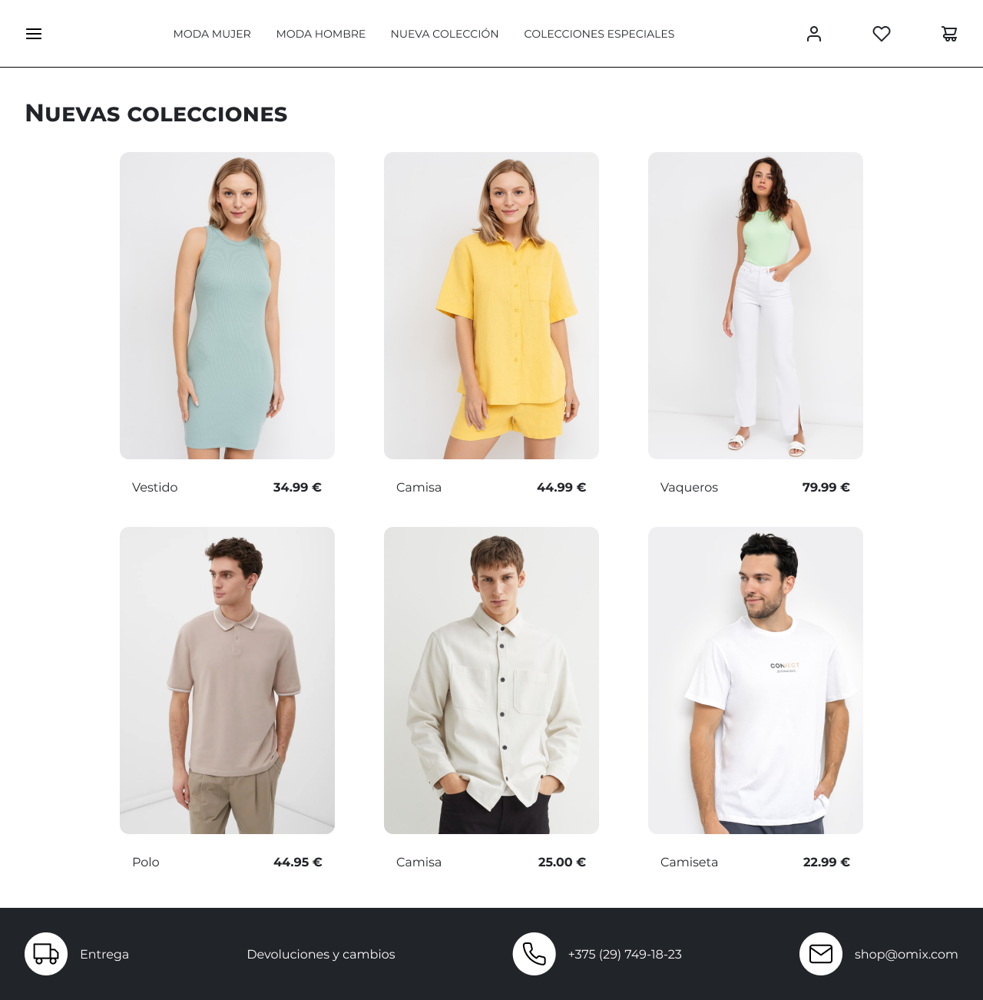
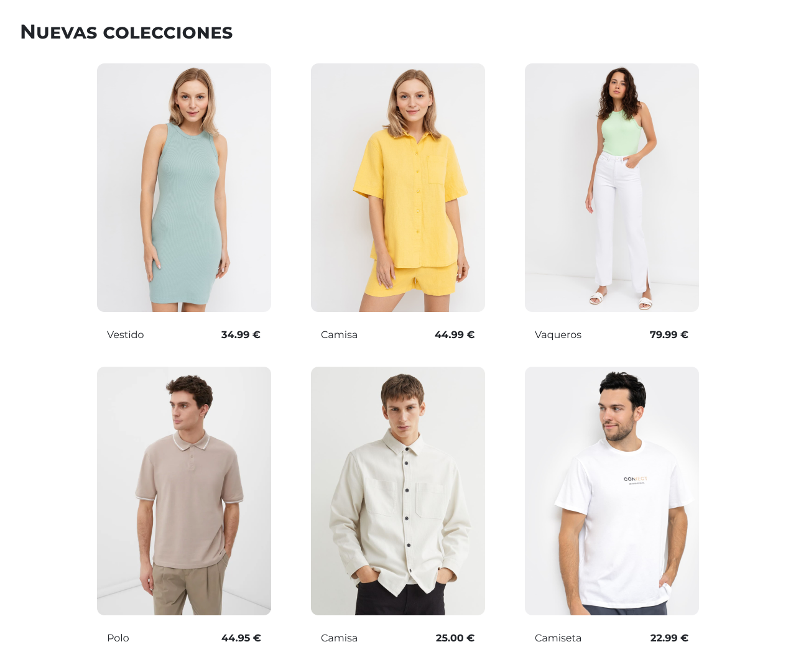

# Laboratorio Módulo 1 - HTML

## Laboratorio HTML

### Introducción

---

Vamos a implementar una página web de una tienda de ropa.

La práctica es un ejercicio de maquetación sin ninguna navegación aunque si te animas puedes añadir efectos tipo :hover a los enlaces y las tarjetas.

### Material

---

#### Tipografía

La fuente utilizada es **_Montserrat_** de Google fonts en sus variantes Regular y Bold.

https://fonts.google.com/specimen/Montserrat?query=monts

#### Tamaños de fuente

- Barra de navegación y footer: 16px
- Título: 32px
- Tarjetas: 14px

#### Medidas y espacios base:

- Ancho de pantalla en diseño: 1280px
- Márgenes y paddings base: 8px, 16px, 32px, ...

#### Colores

- Blanco: .... #ffffff

- Negro: .... #212429

#### Iconos

-  [Descargar](https://raw.githubusercontent.com/Lemoncode/fotos-ejemplos/main/online-shop/icons/icon-heart.svg)
-  [Descargar](https://raw.githubusercontent.com/Lemoncode/fotos-ejemplos/main/online-shop/icons/icon-mail.svg)
-  [Descargar](https://raw.githubusercontent.com/Lemoncode/fotos-ejemplos/main/online-shop/icons/icon-menu-burguer.svg)
-  [Descargar](https://raw.githubusercontent.com/Lemoncode/fotos-ejemplos/main/online-shop/icons/icon-phone.svg)
-  [Descargar](https://raw.githubusercontent.com/Lemoncode/fotos-ejemplos/main/online-shop/icons/icon-shopping-cart.svg)
-  [Descargar](https://raw.githubusercontent.com/Lemoncode/fotos-ejemplos/main/online-shop/icons/icon-truck.svg)
-  [Descargar](https://raw.githubusercontent.com/Lemoncode/fotos-ejemplos/main/online-shop/icons/icon-user.svg)

#### Imagenes

-  [Descargar](https://raw.githubusercontent.com/Lemoncode/fotos-ejemplos/main/online-shop/images/image-1.jpg)
-  [Descargar](https://raw.githubusercontent.com/Lemoncode/fotos-ejemplos/main/online-shop/images/image-2.jpg)
-  [Descargar](https://raw.githubusercontent.com/Lemoncode/fotos-ejemplos/main/online-shop/images/image-3.jpg)
-  [Descargar](https://raw.githubusercontent.com/Lemoncode/fotos-ejemplos/main/online-shop/images/image-4.jpg)
-  [Descargar](https://raw.githubusercontent.com/Lemoncode/fotos-ejemplos/main/online-shop/images/image-5.jpg)
-  [Descargar](https://raw.githubusercontent.com/Lemoncode/fotos-ejemplos/main/online-shop/images/image-6.jpg)

### Apartado obligatorio

---

Maquetar el contenido principal de la página ( Nuevas colecciones ) haciendo que el contenido se adapte de manera responsiva si el tamaño de pantalla cambia.

#### Pistas

Puedes utilizar las propiedades CSS `flex` o `grid`.

### Apartado opcional

---

Implementar la pantalla completa con la barra de navegación y el footer.

- La barra de navegación tiene que mantenerse fija al hacer scroll.
- La hoja de estilos tiene que ser definida en un documento `.css` para ser importada en el documento html.

### Apartado extra

---

Implementa para la barra de navegación y el pie de página un diseño que se adapte a la pantalla, nosotros hemos calculado este diseño para un ancho máximo de `920px`.

