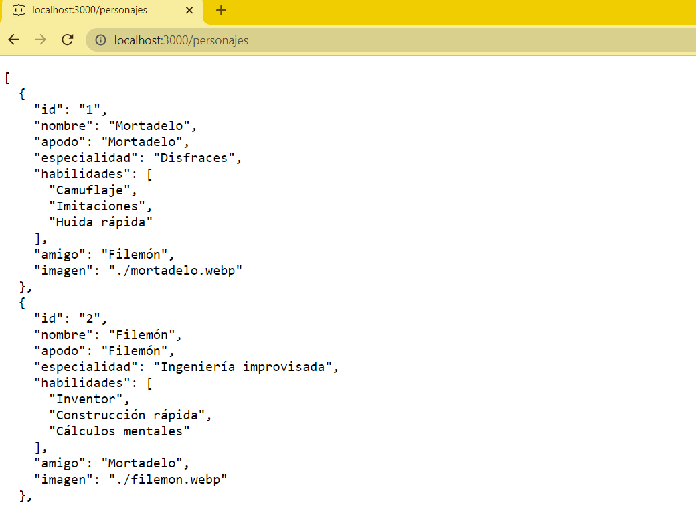
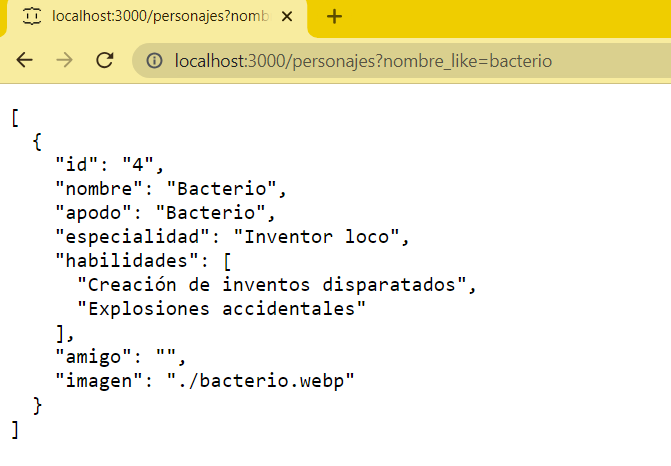
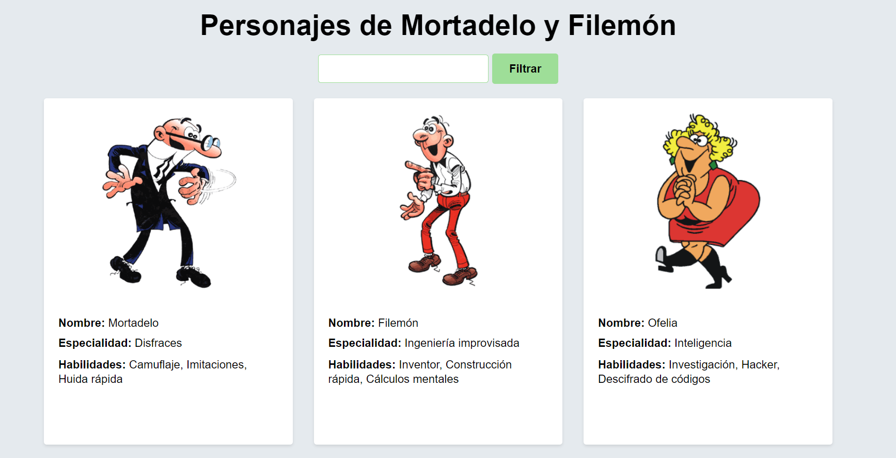
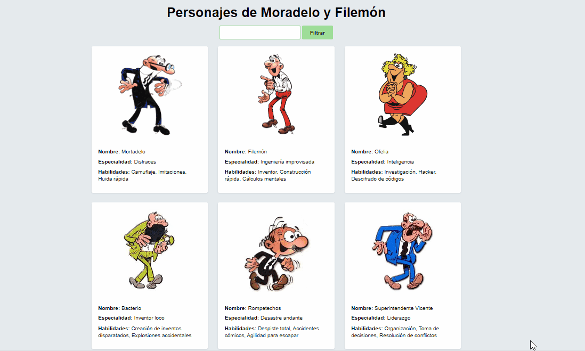

# Módulo 10 - Laboratorio Módulo Asincronía

## Introducción

¿Os acordáis de unos comics que había cuando éramos pequeños que se llamaban Mortadelo y Filemón?

Bueno, los más viejunos seguro que sí 😊, pues hemos creado una API con los personajes de los comics. La podéis encontrar en el siguiente repositorio, en la carpeta 10-async/06-lab-asincronio.

Clonad el repositorio y navegad hasta la carpeta 10-async/06-lab-asincronio.

Una vez dentro, ejecutad npm install para instalar las dependencias y npm start para arrancar el proyecto.

En este proyecto, cómo hemos dicho, tenéis una API con los personajes de los comics de Mortadelo y Filemón. Esta API tiene un endpoint:

- http://localhost:3000/personajes: que devuelve un listado de personajes.



La API tiene un parámetro nombre que permite filtrar los personajes por nombre. Por ejemplo, si queremos buscar los personajes que contengan la palabra bacterio en su nombre, podemos hacerlo de la siguiente manera:

- http://localhost:3000/personajes?nombre_like=bacterio



## Implementación

Vamos a crear una aplicación que nos permita buscar personajes por su nombre. Para ello, vamos a crear un formulario con un campo de texto y un botón.


Cuando se carga la página, se debe mostrar un listado con todos los personajes.



Si el usuario introduce un nombre en el campo de texto y pulsa el botón de filtrar, se debe mostrar un listado con los personajes que contengan el nombre introducido. También se puede mostrar un trozo de texto, por ejemplo, personajes que contengan la palabra `morta` en su nombre.



> Nota: Los estilos son libres, solo hemos mostrado un ejemplo.

## Pistas

- En la API JSON, en la entrada de personajes, hay un campo llamado imagen, en este campo está el nombre de la imagen que se debe mostrar para ese personaje, cuando lo quiera visualizar en el navegador acuérdate de añadir el prefijo http://localhost:3000/ para que se muestre correctamente, es decir:

Para esta entrada:

```
 {
      "id": "1",
      "nombre": "Mortadelo",
      "apodo": "Mortadelo",
      "especialidad": "Disfraces",
      "habilidades": ["Camuflaje", "Imitaciones", "Huida rápida"],
      "amigo": "Filemón",
      "imagen": "mortadelo.webp"
    },
```

Sería (suponiendo que está en una variable llamada personaje):

```
const imagenUrl = `http://localhost:3000/${personaje.imagen}`;
```
