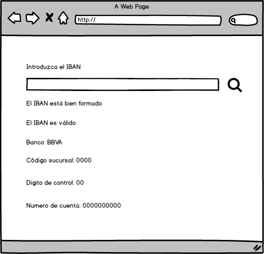
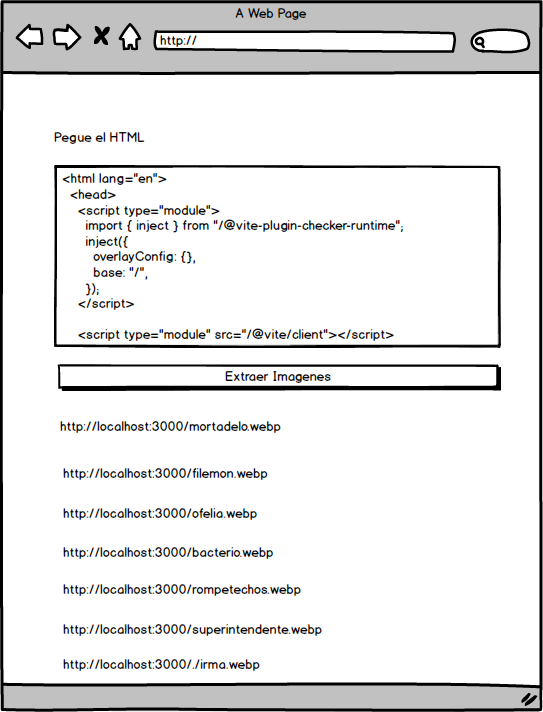

Laboratorio Módulo 11 - Expresiones Regulares
Laboratorio expresiones regulares
Para ambos ejemplos te aconsejamos que tomes como punto de partida la sandbox de TypeScript

Apartado A
Vamos a leer IBAN de cuentas de bancos españoles, ver que estar bien formado, validarlo y extraer información del mismo, mock de la aplicación:

ejemplo aplicacíon IBAN, se introduce el IBAN, se da en buscar, se muestra la info

Un IBAN en España tiene el siguiente formato:

WW 0000 0000 00 0000000000

Donde: WW: código de país 00: dígito de control 0000: código de banco 0000: código de sucursal 00: dígito de control 0000000000: número de cuenta

Queremos poder leer IBAN con espacios, sin espacios, o guiones, por ejemplo:

```
ES21 1465 0100 72 2030876293

ES2114650100722030876293

ES21-1465-0100-72-2030876293

ES6621000418401234567891
```

Valida que un IBAN este bien formado.

Después valida que sea correcto, para ello puedes usar esta librería

https://github.com/Simplify/ibantools

Después extrae el código de sucursal:

Muestra:

-El banco al que pertenece, para ello:
-La oficina.
-El digito de control.
-La cuenta.

Para sacar el nombre del banco

-Extrae el código de banco.
-Compáralo con la siguiente tabla:

```
2080 Abanca Corporación Bancaria

0061 Banca March

0188 Banco Alcalá

0182 Banco Bilbao Vizcaya Argentaria

0130 Banco Caixa Geral

0234 Banco Caminos

2105 Banco Castilla-La Mancha

0240 Banco de Crédito Social Cooperativo

0081 Banco de Sabadell

0487 Banco Mare Nostrum

0186 Banco Mediolanum

0238 Banco Pastor

0075 Banco Popular Español

0049 Banco Santander

3873 Banco Santander Totta

2038 Bankia

0128 Bankinter

0138 Bankoa

0152 Barclays Bank PLC

3842 BNP Paribas Paris

3025 Caixa de Credit del Enginyers

2100 Caixabank

2045 Caja de Ahorros y Monte de Piedad de Ontinyent

3035 Caja Laboral Popular CC

3081 Caja Rural Castilla-La Mancha3058 Cajamar Caja Rural

2000 Cecabank

1474 Citibank Europe PLC

3821 Commerzbank AG

3877 Danske Bank A/S

0019 Deutsche Bank SAE

0239 EVO Banco

2085 Ibercaja Banco

1465 ING Bank NV

2095 Kutxabank

2048 Liberbank

0131 Novo Banco

0073 Open Bank

0108 Société Générale

2103 Unicaja Banco
```

Más información:

https://www.bbva.es/finanzas-vistazo/ef/finanzas-personales/ejemplo-de-iban-en-espana-estos-son-sus-24-caracteres.html

https://www.iban.es/ejemplos.html

Apartado B
Crea una aplicación con un textarea y un botón de "extraer enlaces a imágenes".



Aspiradora de imágenes, se pega contenido HTML y de los tags img saca los enlaces a imágenes

Cuando se pincha en el botón extrae los enlaces a las imágenes que haya en el textarea y las muestra en pantalla.

Es decir:

-Busca todos los tags img
-Por cada tag busca el atributo src
-Muestra el contenido en enlace a la imagen que hay dentro del SRC.

> Para ello tienes que crear una expresión regular que busque un tag que empieza por  y que tenga dentro un atributo src=" y dentro la url de la imagen.

Aquí tienes un HTML de ejemplo:

```
<html lang="en">
  <head>
    <script type="module">
      import { inject } from "/@vite-plugin-checker-runtime";
      inject({
        overlayConfig: {},
        base: "/",
      });
    </script>

    <script type="module" src="/@vite/client"></script>

    <meta charset="UTF-8" />
    <link rel="icon" type="image/svg+xml" href="/vite.svg" />
    <meta name="viewport" content="width=device-width, initial-scale=1.0" />
    <link rel="stylesheet" href="reset-estilos.css" />
    <link rel="stylesheet" href="estilos.css" />
    <title>Laboratorio Asinconía</title>
  </head>
  <body>
    <div class="root">
      <h1>Personajes de Moradelo y Filemón</h1>
      <form class="find-container">
        <input id="search" />
        <button type="submit" id="button-search">Filtrar</button>
      </form>
      <div class="character-list" id="character-list">
        <div class="card">
          
          <div class="container-description">
            <h2><span>Nombre: </span>Mortadelo</h2>
            <p><span>Especialidad: </span>Disfraces</p>
            <p>
              <span>Habilidades: </span>Camuflaje, Imitaciones, Huida rápida
            </p>
          </div>
        </div>
        <div class="card">
          
          <div class="container-description">
            <h2><span>Nombre: </span>Filemón</h2>
            <p><span>Especialidad: </span>Ingeniería improvisada</p>
            <p>
              <span>Habilidades: </span>Inventor, Construcción rápida, Cálculos
              mentales
            </p>
          </div>
        </div>
        <div class="card">
          
          <div class="container-description">
            <h2><span>Nombre: </span>Ofelia</h2>
            <p><span>Especialidad: </span>Inteligencia</p>
            <p>
              <span>Habilidades: </span>Investigación, Hacker, Descifrado de
              códigos
            </p>
          </div>
        </div>
        <div class="card">
          
          <div class="container-description">
            <h2><span>Nombre: </span>Bacterio</h2>
            <p><span>Especialidad: </span>Inventor loco</p>
            <p>
              <span>Habilidades: </span>Creación de inventos disparatados,
              Explosiones accidentales
            </p>
          </div>
        </div>
        <div class="card">
          
          <div class="container-description">
            <h2><span>Nombre: </span>Rompetechos</h2>
            <p><span>Especialidad: </span>Desastre andante</p>
            <p>
              <span>Habilidades: </span>Despiste total, Accidentes cómicos,
              Agilidad para escapar
            </p>
          </div>
        </div>
        <div class="card">
          
          <div class="container-description">
            <h2><span>Nombre: </span>Superintendente Vicente</h2>
            <p><span>Especialidad: </span>Liderazgo</p>
            <p>
              <span>Habilidades: </span>Organización, Toma de decisiones,
              Resolución de conflictos
            </p>
          </div>
        </div>
        <div class="card">
          
          <div class="container-description">
            <h2><span>Nombre: </span>Señorita Irma</h2>
            <p><span>Especialidad: </span>Agente encubierta</p>
            <p>
              <span>Habilidades: </span>Cambios de apariencia, Seducción, Manejo
              de armas
            </p>
          </div>
        </div>
        <div class="card">
          
          <div class="container-description">
            <h2><span>Nombre: </span>Director General de la T.I.A.</h2>
            <p><span>Especialidad: </span>Gestión estratégica</p>
            <p>
              <span>Habilidades: </span>Toma de decisiones, Planificación,
              Coordinación
            </p>
          </div>
        </div>
        <div class="card">
          
          <div class="container-description">
            <h2><span>Nombre: </span>Bestiajez</h2>
            <p><span>Especialidad: </span>Fuerza bruta</p>
            <p><span>Habilidades: </span>Fuerza, Resistencia, Agilidad</p>
          </div>
        </div>
        <div class="card">
          
          <div class="container-description">
            <h2><span>Nombre: </span>Patrona</h2>
            <p><span>Especialidad: </span>Agente encubierta</p>
            <p>
              <span>Habilidades: </span>Cambios de apariencia, Seducción, Manejo
              de armas
            </p>
          </div>
        </div>
      </div>
      <script type="module" src="main.ts"></script>
    </div>
  </body>
</html>
```

Apartado opcional: Puedes también mostrar las imágenes en un CSS Grid o un contendor Flexbox.
