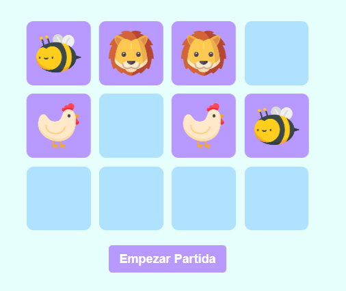
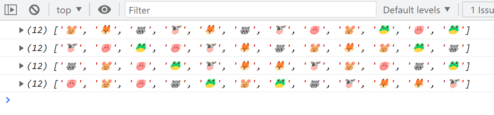
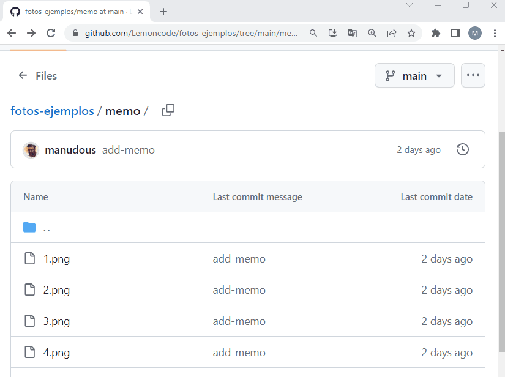

# Módulo 8 - Laboratorio 8.1 y 8.2 Bucles y Array Methods

El objetivo de estos ejercicios es que te familiarices con los bucles for y while, no implementes arrays methods, estos los veremos en el siguiente laboratorio.

Después te toca implementarla con array methods, verás que bien que queda con esta nueva aproximación.

### Introducción

Estamos desarrollando un software hospitalario, y el cliente nos pide poder realizar una serie se operaciones sobre una lista de pacientes.

El set de datos inicial:

```
type Especialidad = "Medico de familia" | "Pediatra" | "Cardiólogo";

interface Pacientes {
  id: number;
  nombre: string;
  apellidos: string;
  sexo: string;
  temperatura: number;
  frecuenciaCardiaca: number;
  especialidad: Especialidad;
  edad: number;
}

const pacientes: Pacientes[] = [
  {
    id: 1,
    nombre: "John",
    apellidos: "Doe",
    sexo: "Male",
    temperatura: 36.8,
    frecuenciaCardiaca: 80,
    especialidad: "Medico de familia",
    edad: 44,
  },
  {
    id: 2,
    nombre: "Jane",
    apellidos: "Doe",
    sexo: "Female",
    temperatura: 36.8,
    frecuenciaCardiaca: 70,
    especialidad: "Medico de familia",
    edad: 43,
  },
  {
    id: 3,
    nombre: "Junior",
    apellidos: "Doe",
    sexo: "Male",
    temperatura: 36.8,
    frecuenciaCardiaca: 90,
    especialidad: "Pediatra",
    edad: 8,
  },
  {
    id: 4,
    nombre: "Mary",
    apellidos: "Wien",
    sexo: "Female",
    temperatura: 36.8,
    frecuenciaCardiaca: 120,
    especialidad: "Medico de familia",
    edad: 20,
  },
  {
    id: 5,
    nombre: "Scarlett",
    apellidos: "Somez",
    sexo: "Female",
    temperatura: 36.8,
    frecuenciaCardiaca: 110,
    especialidad: "Cardiólogo",
    edad: 30,
  },
  {
    id: 6,
    nombre: "Brian",
    apellidos: "Kid",
    sexo: "Male",
    temperatura: 39.8,
    frecuenciaCardiaca: 80,
    especialidad: "Pediatra",
    edad: 11,
  },
];
```

## Apartados obligatorios

### Apartado 1

a) Queremos extraer la lista de paciente que están asignados a la especialidad de Pediatría

Firma de la función:

```
const obtenPacientesAsignadosAPediatria = (
pacientes: Pacientes[]
): Pacientes[] => {
// Tu implementación aquí :)
};
```

b) Queremos extraer la lista de pacientes asignados a Pediatría y que tengan una edad menor de 10 años.

```
const obtenPacientesAsignadosAPediatriaYMenorDeDiezAnios = (
pacientes: Pacientes[]
): Pacientes[] => {
// Tu implementación aquí :)
};
```

### Apartado 2

Queremos activar el protocolo de urgencia si cualquier de los pacientes tiene un ritmo cardíaco superior a 100 pulsaciones por minuto y una temperatura corporal superior a 39 grados.

Es decir, crear una función que devuelve true/false dependiendo si se da la condición, algo así como:

```
const activarProtocoloUrgencia = (pacientes: Pacientes[]): boolean => {
let activarProctolo = false;

// Tu implementación aquí :)

return activarProctolo;
};
```

### Apartado 3

El pediatra no puede atender hoy a los pacientes, queremos reasignar los pacientes asignados a la especialidad de pediatría a la de medico de familia.

```
const reasignaPacientesAMedicoFamilia = (
pacientes: Pacientes[]
): Pacientes[] => {
// Tu implementación aquí :)
};
```

### Apartado 4

Queremos saber si podemos mandar al Pediatra a casa (si no tiene pacientes asignados), comprobar si en la lista hay algún paciente asignado a pediatría

```
const HayPacientesDePediatria = (pacientes: Pacientes[]): boolean => {
// Tu implementación aquí :)
};
```

## Apartados opcionales

### Apartado 5

Queremos calcular el número total de pacientes que están asignados a la especialidad de Medico de familia, y lo que están asignados a Pediatría y a cardiología

```
interface NumeroPacientesPorEspecialidad {
medicoDeFamilia: number;
pediatria: number;
cardiologia: number;
}

const cuentaPacientesPorEspecialidad = (
pacientes: Pacientes[]
): NumeroPacientesPorEspecialidad => {
// Tu implementación aquí :)
};
```

# Laboratorio Módulo 8.3 - Aplicación Memoria

## Laboratorio Bucles - aplicación memoria

Introducción
Queremos implementar el clásico juego de las parejas ¿En que consiste esto?

- Mostramos al usuario 12 cartas boca abajo.
- El usuario pincha en una carta y se ve el contenido de la misma (por ejemplo un gatito).
- El usuario pincha en otra carta y se ve el contenido de la misma
  -Si por ejemplo es un perrito, ambas cartas se ocultan y vuelta a empezar.
  -Si es un gatito (y la carta origen era el mismo gatito), se quedan las dos cartas bocarriba y el usuario vuelve a jugar.
- Esto así hasta que el usuario encuentre todas las parejas.



> Este proyecto es tu primer desafío de embergadura, ante cualquier duda, no te cortes y contacta con tu mentor.

## Pruebas de concepto

Podrías intentar desarrollar este minijuego de un tirón, Pero ¿Qué riesgo tienes? Que en uno de los pasos metas la pata, y ya decidas barrer sobre la alfombra y empezar a degradar tu código en aras de que la cosa "se entregue".

Así que vamos a dividir en problema en pruebas de concepto (en la entrega final crea una carpeta por cada prueba de concepto).

Cuando tengamos "domados" todos los desafíos vamos a por la implementación de la aplicación final que será la carpeta con el numero...

### Prueba de concepto 1 - barajar las cartas

- Vamos a tener un array de cartas y ¿Sabes que? Nos va a hacer falta barajar las cartas (si no cada partida sería igual), ¿Cómo hacemos esto?

  - Te toca preguntarle a tu IA favoritca como se pueden barajar un array en javascript (si lo prefieres en inglés utiliza el termino "shuffle array javascript").
  - Por otro lado mira en stackoverflow este hilo.
    Y aquí verás varias soluciones:

- Unas que usan conceptos avanzados de javascript como generadores (cuando veas yield).
- Otras que se apoyan en librerías externdas (lodash)
- Otra que pone: Understandable way of shuffling elements of an array en la que puedes entender como funciona si echas un rato.
- Para ambas soluciones te hará falta después tiparlas con genéricos o también lo podrás tipar con el tipo en concreto que vayas a definir para las cartas.



### Prueba de concepto 2 - Mostrar imagen y volver la carta

En esta prueba de concepto vamos a mostrar una carta, y cuando el usuario pinche en ella, la carta se va a volver y va a mostrar la imagen.

¿Cómo lo hacemos?

- Vamos a crear un div con una imagen dentro en el HTML.
- Vamos a escuchar al evento click del div.
- Cuando el usuario pinche en el div, vamos a cambiar el src de la imagen.

Sólo una carta, es para desmotrarnos que sabemos resolver este desafío.


> Nota: El efecto de voltear la carta no es necesario.

### Prueba de concepto 3 - Mostrar un Grid de cartas

Ahora vamos a mostrar un grid de cartas, ¿Cómo lo hacemos?

- En el HTML vamos a tener un div, contenedor, con 12 divs dentro.
- Usamos CSS Grid para mostrar las cartas en una rejilla de 4x3.

Sólo queremos el grid, no queremos que las cartas se puedan voltear.


### Prueba de concepto 4 - Mostrar segunda imagen y volver las dos cartas

Ahora vamos a mostrar dos cartas, y cuando el usuario pinche en la segunda, las dos cartas se van a voltear y van a mostrar la imagen.

¿Cómo lo hacemos?

- Vamos a crear dos divs con una imagen dentro de cada uno en el HTML.
- Vamos a escuchar al evento click de los divs.
- Cuando el usuario pinche en el primer div, vamos a cambiar el src de la imagen.
- Cuando el usuario pinche en el segundo div, vamos a cambiar el src de la imagen.

Sólo dos cartas, es para desmotrarnos que sabemos resolver este desafío.


> Nota: El efecto de voltear la carta no es necesario.

### Prueba de concepto 5 - Mapear el DIV que contiene la carta con la posición del array de las cartas

Lo que queremos hacer en esta prueba de concepto es mapear el div que contiene la carta con la posición del array de las cartas, es decir, si el usuario pincha en la primera carta, queremos saber que es la primera carta del array de cartas.

¿Cómo lo hacemos?

- Vamos a crear un array de cartas.
- El array va a tener 2 cartas de cada foto.
- Vamos a crear un div por cada carta.
- A cada div le vamos a poner un atributo
  con el indice del array de cartas que le corresponde.
- Vamos a escuchar al evento click de los divs.
- Dentro de cada div vamos a tener una imagen, y vamos a cambiar el src de la imagen.
- Para hacer esto dentro de cada imagen vamos a tener un atributo que va a tener el mismo índice que el div que la contiene.
- Cuando el usuario pinche en el primer div, vamos a leer el atributo data-indice-id y vamos a saber que es la primera carta del array de cartas y mostraremos la imagen correspondiente.

Para hacer esto podemos crear una interfaz que nos ayude a tipar el array de cartas:

```
interface InfoCarta {
idFoto: number;
imagen: string;
}
```

Y luego crear un array de cartas que contenga la información de varias cartas, tampoco hace falta que sean muchas, con 2 o 3 cartas nos vale, ten en cuenta que luego van a ir repetidas.

En este repositorio tenemos imágenes de animales que podemos utilizar:

[Repositorio de imágenes](https://github.com/Lemoncode/fotos-ejemplos/tree/main/memo)

Para usarlas es tan fácil como pinchar en la foto, botón derecho del ratón, abrir imagen en pestaña nueva y copiamos la URL de la imagen.


Y así quedaría una carta:

```
{
idFoto: 1,
imagen: "https://raw.githubusercontent.com/Lemoncode/fotos-ejemplos/main/memo/1.jpg",
}
```

> Nota Importante: El índice del array no identifica a la foto de la carta, sólo a un la posición en el array.

## Implementación

Esto puede tener multiples formas de implementarse, la que vamos a seguir:

Como es un juego dividimos entre modelo, motor, ui
También crearemos una área de constantes.

### Modelo - a definir

Sobre el modelo que definiremos:

\_./src/model.ts

```
export interface Carta {
idFoto: number; // id del 1 al 6 para 12 cartas, así identificamos rápido si es un gatito ,un perrito...
// el ID se repete 2 veces en el array de cartas (hay dos cartas de un perro, hay dos cartas de un gato)
imagen: string; // por comodidad repetimos la url de la imagen
estaVuelta: boolean;
encontrada: boolean;
}

interface InfoCarta {
idFoto: number;
imagen: string;
}

const infoCartas: InfoCarta[] = [
/* Aquí ponemos seis cartas siguiendo la interfaz de InfoCarta */
];

const crearCartaInicial = (idFoto: number, imagen: string): Carta => ({
idFoto,
imagen,
estaVuelta: false,
encontrada: false,
});

const crearColeccionDeCartasInicial = (infoCartas: InfoCarta[]): Carta[] => {
/_ Aquí crearemos un array de cartas a partir de un array de infoCartas
y duplicaremos las cartas para que haya dos de cada tipo.
_/
};

export let cartas: Carta[] = crearColeccionDeCartasInicial(infoCartas);

/_
Aquí definimos el tipo de estado de la partida, la idea es que cuando empiece la partida todas las cartas estén boca abajo y si se hacen click sobre ellas no se volteen.
EstadoPartida = "PartidaNoIniciada", una vez que se pulse Iniciar partida el estado de la partida cambiaría a "CeroCartasLevantadas" y así sucesivamente.
_/

type EstadoPartida =
| "PartidaNoIniciada"
| "CeroCartasLevantadas"
| "UnaCartaLevantada"
| "DosCartasLevantadas"
| "PartidaCompleta";

export interface Tablero {
cartas: Carta[];
estadoPartida: EstadoPartida;
indiceCartaVolteadaA?: number;
indiceCartaVolteadaB?: number;
}

const crearTableroInicial = (): Tablero => ({
cartas: cartas,
estadoPartida: "PartidaNoIniciada",
});

export let tablero: Tablero = crearTableroInicial();

```

### Motor - pistas

En el motor nos va a hacer falta un método para barajar cartas:

```
/_
En el motor nos va a hacer falta un método para barajar cartas
_/
const barajarCartas = (cartas : Carta[]): Carta[] => {
//...
}

/_
Una carta se puede voltear si no está encontrada y no está ya volteada, o no hay dos cartas ya volteadas
_/
const sePuedeVoltearLaCarta = (tablero: Tablero, indice: number ): boolean => {
//..
}

const voltearLaCarta = (tablero: Tablero, indice: number) : void => {
//...
}

/_
Dos cartas son pareja si en el array de tablero de cada una tienen el mismo id
_/
export const sonPareja = (indiceA: number, indiceB: number, tablero: Tablero): boolean => {
//...
}

/_
Aquí asumimos ya que son pareja, lo que hacemos es marcarlas como encontradas y comprobar si la partida esta completa.
_/
const parejaEncontrada = (tablero: Tablero, indiceA: number, indiceB: number) : void => {
//...
}

/_
Aquí asumimos que no son pareja y las volvemos a poner boca abajo
_/
const parejaNoEncontrada = (tablero: Tablero, indiceA :number, indiceB : number) : void => {
// ...
}

/_
Esto lo podemos comprobar o bien utilizando every, o bien utilizando un contador (cartasEncontradas)
_/
export const esPartidaCompleta(tablero: Tablero) : boolean => {
//...
}

/_
Iniciar partida
_/

export const iniciaPartida = (tablero: Tablero): void => {
//...
};
```

> Todos estos métodos se pueden implementar siguiendo TDD.

#### UI - pistas

¿Qué debemos hacer aquí?

Habrá un botón para empezar partida, ese lo que hará es:

- Crear el tablero inicial
- Barajar las cartas

En el HTML tendremos un CSS grid con todas las cartas (boca abajo, src de carta boca abajo) y un atributo data-indice-array en el que tendremos el indice del array al que corresponden, así pues la partida arranca con

- Todas las cartas boca abajo.
- Escuchando al evento click de cada carta (cuando el usuario pinche en una leeremos de data-indice-array, la posición del array de la carta).

En cuanto el usuario pinche en una carta:

- Miramos si la carta es volteable (ver motor).
- Si es volteable la voltearemos (cambiamos el src de la imagen), para la imagen sería recomendable crear data-indice-imagen, va a coincidir con el índice del div para pintar la imagen correspondiente al índice del array de cartas.
- Comprobamos si estamos elegiendo una carta o estamos en la segunda.
- Si estamos en la segunda comprobamos si son pareja o no.
- En caso de que si las dejamos fijas.
- En caso de que no esperamos un segundo (setTimeout) y las ponemos boca abajo (reseteamos su estado sin voltear)
- Vuelta a empezar

##### ¿Qué es esto de setTimeout?

Es una función de javascript que nos permite ejecutar una función pasados X milisegundos, por ejemplo:

```
setTimeout(() => {
console.log("Hola");
}, 1000);
```

Esto ejecutará el console.log("Hola") pasados 1000 milisegundos (1 segundo).

## Apartados opcionales

Que mejoras puedes implementar:

- Mostrar cuantos intentos lleva el usuario.
- Mostrar una animación cuando el usuario pinche en una carta.
- Mostrar un efecto hover cuando el usuario ponga el ratón sobre una carta.
- Que si el usuario pincha en una carta ya volteada le salga un mensaje.
